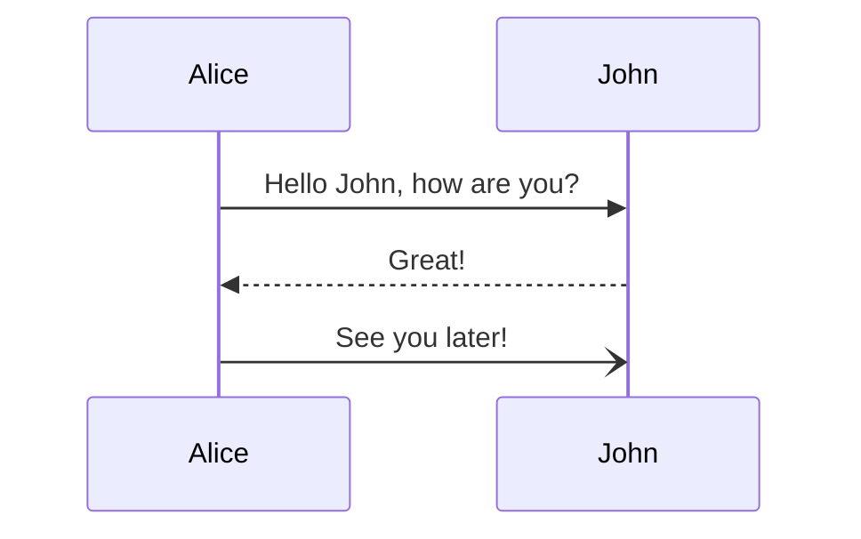

[Mermaid] is a Markdown-inspired tool that renders text into diagrams, which [Github natively supports]. But unfortunately, Github Pages does not support
use of Mermaid by default. So the user has to manually integrate Mermaid into their Github Pages in order to use it.<br>

Luckily, it isn't that hard to do so with HydeJack theme.

[Mermaid]: https://mermaid.js.org/
[Github natively supports]: https://docs.github.com/en/get-started/writing-on-github/working-with-advanced-formatting/creating-diagrams

<!--more-->

* this unordered seed list will be replaced by the toc
{:toc}

## Implementation

You can check [the commit] directly if you'd like.

[the commit]: https://github.com/LazyRen/LazyRen.github.io/commit/e03bedc64f5a9d85f4ab8ce967b7533c4f711bc4

### [_config.yml]

Simply puts below option to anywhere.<br>
(Somewhere around `# 3rd Party Integrations` would be sufficient)

```yml
# file: "_config.yml"
mermaid: true
```

[_config.yml]: https://github.com/LazyRen/LazyRen.github.io/blob/master/_config.yml#L227

### [my-scripts.html]

Use [Hydejack event listener] so the code can be executed every time the page gets loaded.

```html
<!-- file: "_includes/my-scripts.html" -->

<script type="module">
  
  import mermaid from "https://cdn.jsdelivr.net/npm/mermaid@10/dist/mermaid.esm.min.mjs";
  let config = {
    startOnLoad: true,
    fontFamily: "JetBrains Mono",
    theme: "dark"
  };
  mermaid.initialize(config);
  mermaid.run({ querySelector: ".language-mermaid" });
  
  document
    .getElementById("_pushState")
    .addEventListener("hy-push-state-load", function () {
       mermaid.run({ querySelector: ".language-mermaid" }); 
    });
</script>

```

I have manually changed theme to `dark` as `default` theme does not fit well with current dark mode of the Hydejack.<br>
Also the `fontFamily` is changed to my favorite coding font of all time, `JetBrains Mono`.

Check [Mermaid Config Schema] for more information.

[my-scripts.html]: https://github.com/LazyRen/LazyRen.github.io/blob/master/_includes/my-scripts.html
[Hydejack event listener]: https://hydejack.com/docs/scripts/#registering-push-state-event-listeners
[Mermaid Config Schema]: https://mermaid.js.org/config/schema-docs/config.html
