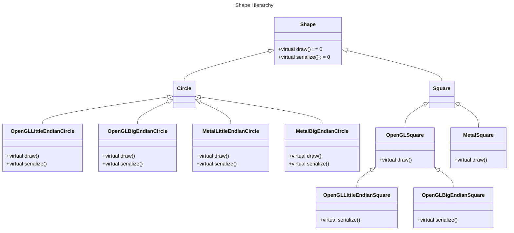
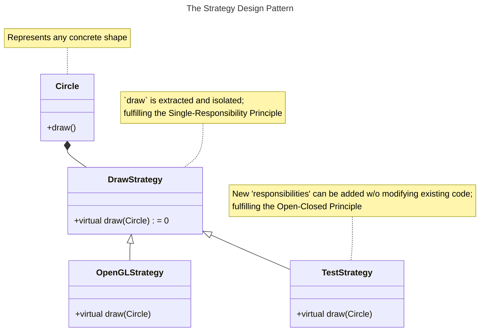

<div class="iframe-container">
    <iframe src="https://www.youtube.com/embed/motLOioLJfg?si=Jc7_FHhNraqGyhm0" frameborder="0" allow="accelerometer; autoplay; clipboard-write; encrypted-media; gyroscope; picture-in-picture" allowfullscreen></iframe>
</div>

> Software must be adaptable to frequent changes

<!--more-->

* this unordered seed list will be replaced by the toc
{:toc}

## Design Guidelines

* Spent time to find good names for all entities

### Designing Hierarchy



Using inheritance naively to solve our problem easily leads to ...

* many derived classes
* ridiculous class names
* deep inheritance hierarchies
* duplication between similar implementations
* (almost) impossible extensions
* impeded maintenance

Resist urge to put everything into one class. Separate concerns!
{:.note title="Guideline"}

Design classes for easy change/extensions.
{:.note title="Guideline"}

#### Solution

##### The Single-Responsibility Principle (SRP)

> Everything should do just one thing.

Separate concerns to **isolate and simplify change.**

* Separation of Concerns
* High cohesion / low coupling
* Orthogonality

##### The Open-Closed Principle (OCP)

> Prefer design that simplifies the extension by types or operations

##### Don't Repeat Yourself (DRY)

> Reduce duplication in order to **simplify change.**

##### The Strategy Design Pattern



```c++
class Circle;
using DrawCircleStrategy = std::function<void(Circle const&)>

class Circle : public Shape
{
public:
    Circle(double radius, DrawCircleStrategy strategy) // Dependency Injection
        : m_radius { radius }
        , // ... remaining data members
        , m_drawing { std::move(strategy) }
    {}

    // ...

private:
    double m_radius;
    // ...
    DrawCircleStrategy m_drawing;
}

// Using template for the same intent
template<typename DrawStrategy> // Dependency Injection
class Square : public Shape
{
public:
    Square(double side)
        : m_side { side }
        , // ... remaining data members
    {}

    // ...

    void draw(/* ... */) const override
    {
        DrawStrategy{}(this, /* ... */);
    }

private:
    double m_side;
    // ...
}

class OpenGLCircleStrategy : public DrawCircleStrategy
{
public:
    // ...

    void draw(const Circle&) const override;
}

class OpenGLSquareStrategy : public DrawSquareStrategy
{
public:
    // ...

    void draw(const Circle&) const override;
}
```

* Extracted implementation details (SRP)
* Created the opportunity for easy change / extension (OCP)
* reduced duplication (DRY)
* Limited the depth of the inheritance hierarchy

= Simplified maintenance

### The Template Method Design Pattern

```c++
class PersistenceInterface
{
public:
    // ...

    virtual bool write(const Blob& blob) = 0;
    virtual bool write(const Blob& blob, WriteCallback callback) = 0;
    virtual bool read(Blob& blob, uint timeout) = 0;
    virtual bool read(Blob& blob, ReadCallback callback, uint timeout) = 0;
}
```

The virtual functions may pose a problem in the future ...

* they represent the **interface to caller**
* they represent the **interface for deriving classes**

= don't separate concerns -> potentially introduces a lot of duplication
= make changes harder

#### Solution

```c++
class PersistenceInterface
{
public:
    // ...
    bool write(const Blob& blob) = 0;
    bool write(const Blob& blob, WriteCallback callback) = 0;
    bool read(Blob& blob, uint timeout) = 0;
    bool read(Blob& blob, ReadCallback callback, uint timeout) = 0;

private:
    virtual bool write(const Blob& blob) = 0;
    virtual bool write(const Blob& blob, WriteCallback callback) = 0;
    virtual bool read(Blob& blob, uint timeout) = 0;
    virtual bool read(Blob& blob, ReadCallback callback, uint timeout) = 0;
}
```

##### Non-Virtual Interface Idiom (NVI)

* Separation of concern
  * Public interface / Derived class
* Internal changes have no impact on callers
* Reduced duplication (DRY)

## Implementation Guidelines

### Resource Management

#### The Rule of 0

```c++
class Widget
{
public:
    // No default operations declared

    ~Widget() = default;

private:
    int i;         // representative of a fundamental type
    std::string s; // representative of a user-defined type
}
```

*Core Guideline C.20*: If you can avoid defining default operations, do
{:.note title="Guideline"}

#### Resource Ownership

```c++
class Widget
{
public:
    Widget() = default;
    Widget(const Widget&) = default;
    Widget(Widget&&) noexcept = default;

    Widget& operator=(const Widget&) = default;
    Widget& operator=(Widget&&) noexcept = default;

    ~Widget() { delete p }; // Not ideal - as pointer is used for a owned resource

private:
    int i;         // representative of a fundamental type
    std::string s; // representative of a user-defined type
    Resource* p;   // representative of a possible resource
}
```

*Core Guideline C.32*: If a class has a raw pointer (`T*`) or reference (`T&`), consider whether it might be owning<br>
*Core Guideline C.33*: If a class has an owning pointer member, define a **destructor**<br>
*Core Guideline R.3*: A raw pointer (`T*`) is non-owning<br>
*Core Guideline R.1*: Manager resources automatically using resource handles and **RAII** (Resource Acquisition Is Initialization)
{:.note title="Guideline"}

**RAII** is *the most* important idiom in C++.

#### The Rule of 5

```c++
class Widget
{
public:
    Widget() = default;
    Widget(const Widget&); // User must define it - because of `unique_ptr`
    Widget(Widget&&) noexcept = default;

    Widget& operator=(const Widget&); // User must define it - because of `unique_ptr`
    Widget& operator=(Widget&&) noexcept = default;

    ~Widget() { delete p };

private:
    int i;                         // representative of a fundamental type
    std::string s;                 // representative of a user-defined type
    std::unique_ptr<Resource> p;   // unique_ptr CANNOT be copied
}
```

Strive for the *rule of 0*: Classes that don't require an explicit destructor, copy operations and move operations are much easier to handle.
{:.note title="Guideline"}

*Core Guideline C.21*: If you define or `=delete` any default operation, define or `=delete` them all
{:.note title="Guideline"}

### Data Member Initialization

#### Default Initialization vs Value Initialization

```c++
struct Widget
{
    int i;         // w1: Uninitialized   / w2: Initialized to 0
    std::string s; // w1: Default (empty) / w2: Default (empty)
    int* pi;       // w1: Uninitialized   / w2: Initialized to nullptr
}

int main()
{
    Widget w1;    // Default initialization calls the default constructor
    Widget w2 {}; // Value initialization
}
```

If no default constructor is declared, value initialization do ...

* zero-initializes the object
* and then default-initializes all non-trivial data members

Prefer to create default objects by means of an empty set of braces (value initialization)
{:.note title="Guideline"}

#### Empty Default Constructor

```c++
struct Widget
{
    Widget() {}    // Explicit default constructor

    int i;         // w1 & w2: Uninitialized
    std::string s; // w1 & w2: Default (empty)
    int* pi;       // w1 & w2: Uninitialized
}

int main()
{
    Widget w1;    // Default initialization calls the default constructor
    Widget w2 {}; // Value initialization -> call default constructor
}
```

An empty default constructor ...

* initializes all data members of class type
* but not the data members of fundamental type

Avoid writing empty default constructor
{:.note title="Guideline"}

#### Member Initialization List

```c++
struct Widget
{
    Widget()
        : Widget(30) // Delegating constructor
    {}

    Widget(int j)
        : i { j }
    {} // The lifetime of the object begins with the closing brace of the delegated constructor

    // Data members with in-class initializers
    int i { 42 };
    std::string s { "CppCon" };
    int* pi { nullptr };
}
```

*Core Guideline C.44*: Prefer default constructors to be simple and non-throwing<br>
*Core Guideline C.47*: Define and initialize member variables in the order of member declaration<br>
*Core Guideline C.48*: Prefer in-class initializers to member initializers in constructors for constant initializers
*Core Guideline C.49*: Prefer initialization to assignment in constructor<br>
*Core Guideline C.51*: Use delegating constructors to represent common actions for all constructors of a class
{:.note title="Guideline"}

Member initialization order follows the order of member declaration.

### Implicit Conversions

```c++
struct Widget
{
    explicit Widget(int) { std::puts("Widget(int)"); }
}

void f(Widget);

int main()
{
    f(42);         // Compilation error! No matching function for 'f(int)'
    f(Widget(42)); // Calls `f(Widget)`
}
```

*Core Guideline C.46*: By default, declare single-argument constructors `explicit`
{:.note title="Guideline"}

### Order of Member Data

```c++
struct Widget
{
    bool b1;  // char padding1[7];
    double d; // Needs to be 8-byte aligned on x64
    bool b2;  // char padding2[7];
}

struct Widget2
{
    double d; // Largest first
    bool b1;
    bool b2;  // char padding[6];
}

int main()
{
    std::cout << sizeof(Widget) << std::endl; // prints 24
    std::cout << sizeof(Widget2) << std::endl; // prints 16
}
```

Consider the alignment of data members when adding member data to a struct or class
{:.note title="Guideline"}

### Const Correctness

```c++
template <typename Type, size_t Capacity>
class FixedVector
{
public:
    using iterator = Type*;
    using const_iterator = const Type*;
    iterator begin() noexcept;
    const_iterator begin() const noexcept;
    iterator end() noexcept;
    const_iterator end() const noexcept;

    // ...
}
```

*Core Guideline Con.2*: By default, make member functions `const`
{:.note title="Guideline"}

Make getters `const` with const reference such as `const Type&` unless there is a strong reason not to.

### Qualified / Modified Member Data

```c++
struct Widget
{
    const int i;
    double& d;

    // Widget& operator=(const Widget&) // Implicitly deleted
    // Widget& operator=(Widget&&)      // Not declared
}
```

Assignment to const data members or references doesn't work, so the compiler cannot generate assignment operators.

#### Solution

```c++
#include <functional>
class Widget
{
public:
    double& get() noexcept { return d; }
    const double& get() const noexcept { return d; }

private:
    std::reference_wrapper<double> d;
}
```

Use pointer or a `reference_wrapper` instead of a reference member.<br>
Unless there is a strong reason to, do not make a member variable `const`. (Make variable `private` and don't have setter is enough in most cases)

*Core Guideline C.12*: Don't make data members `const` or references
{:.note title="Guideline"}

### Visibility vs Accessibility

Remember the four steps of the compiler to resolve a function call:

1. **Name lookup**: Select all candidate functions with a certain name within the current scope. If none is found, proceed into the next surrounding scope.
2. **Overload resolution**: Find the best match among the selected candidate functions. If necessary, apply the necessary argument conversions.
3. **Access labels**: Check if the best match is accessible from the given call site.
4. **=delete**: Check if the best match has been explicitly deleted.

## Reference

* [Back to Basics: Designing Classes 1 - Klaus Iglberger - CppCon 2021](https://www.youtube.com/watch?v=motLOioLJfg)
* [Back to Basics: Designing Classes 2 - Klaus Iglberger - CppCon 2021](https://www.youtube.com/watch?v=O65lEiYkkbc)
* [C++ Core Guidelines](https://isocpp.github.io/CppCoreGuidelines/CppCoreGuidelines)
